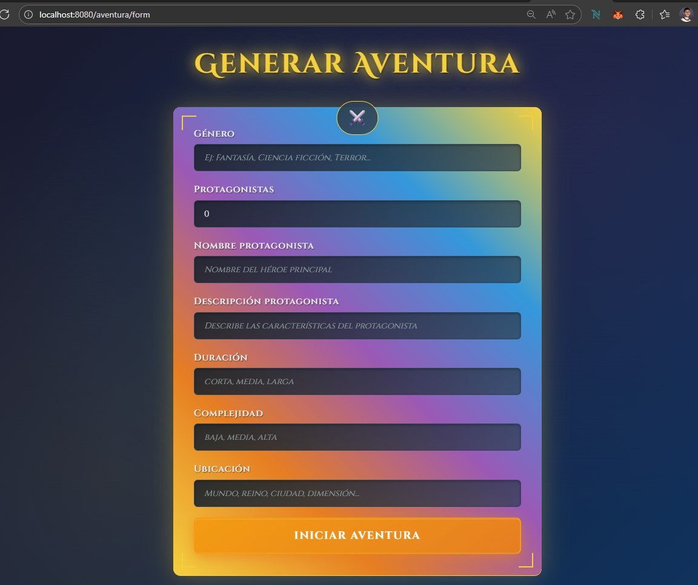
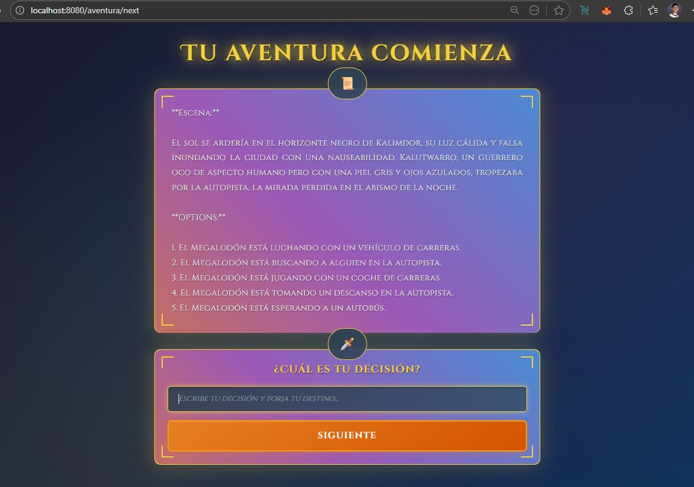

# Spring AI Adventure

**Spring AI Adventure** es una aplicación web que permite generar y jugar una aventura interactiva "elige tu propia aventura" utilizando modelos de lenguaje (LLM) y generación de imágenes. Está construida con **Spring Boot**, integrando **Spring AI** y **Ollama** para la generación de texto, y opcionalmente **Stable Diffusion WebUI** para imágenes.




---

## Features

* Generación de historias de aventura personalizadas según:
  * Género (acción, comedia, fantasía, etc.)
  * Protagonista
  * Duración (corta, media, larga)
  * Complejidad (baja, media, alta)
* Sistema de **turnos**: la historia avanza según las decisiones del usuario.
* **Rastreo del estado del personaje**: físico, emocional, decisiones tomadas y resumen de la historia.
* **RAG (Retrieval-Augmented Generation) simple**: cada turno incorpora un feature del Megalodón para enriquecer la historia.
* **Mensaje final** personalizado según el desarrollo de la aventura:
  > "Gracias por abrirnos los caminos".
* **Generación de imágenes** asociadas a la historia usando Stable Diffusion WebUI (opcional).

---

## Requisitos

* Java 17+
* Maven 3+
* Python 3.10 para dependencias de generación de imágenes(opcional).
* Ollama instalado y corriendo (localhost:11434)
* Modelo LLM descargado. Se sugiere gemma:2b para puebas o mistral. Ejemplo: `ollama pull mistral`
* Navegador web moderno

---

## Instalación y ejecución rápida (speedrun)

1. Clonar o crear el proyecto con los archivos proporcionados.

2. Ejecutar:
   ```bash
   mvn clean package
   mvn spring-boot:run
   ```

3. Instalar Ollama y descargar el modelo:
   ```bash
   ollama pull mistral
   ```

4. Asegurarse de que Ollama esté corriendo en `localhost:11434`.

5. Reemplazar la función `callLLM` por una llamada HTTP a Ollama si se desea personalizar la integración.

6. Abrir en el navegador:
   ```
   http://localhost:8080/
   ```
   Probar con inputs mínimos:
   * Género: Acción
   * Protagonista: "Sergio el valiente"
   * Duración: Corta
   * Complejidad: Baja

7. Para iniciar una aventura completa:
   ```
   http://localhost:8080/aventura/form
   ```
   * Completar los campos.
   * Al enviar, el backend llama a Mistral vía Spring AI.
   * La historia se renderiza en `scene.html`.

---

## Flujo de la Aventura

1. El usuario completa los datos iniciales.
2. Se genera el **inicio de la historia**.
3. Cada turno:
   * El usuario toma decisiones.
   * Se actualiza el estado físico/emocional del protagonista.
   * Se incorpora un feature del Megalodón (RAG simple).
4. Al final:
   * Se cuentan las menciones de elementos clave.
   * Se muestra el mensaje final:
     > "Gracias por abrirnos los caminos".

---

## Generación de imágenes(opcional)

La aplicación incluye integración completa con **Stable Diffusion WebUI** para generar imágenes automáticamente en cada turno usando el prompt response generado por el LLM.

IMPORTANTE: Existe una variable en el archivo application.properties "adventure.images.enabled" que permite habilitar o deshabilita la generación de imágenes.

**Requisitos obligatorios:**
* Instalar y ejecutar **Stable Diffusion WebUI** localmente
* Mantener la instancia local levantada para el uso de la API local con Spring
* Contar con GPU NVDIA

**Funcionalidad:**
* Cada turno genera automáticamente imágenes del escenario o personaje
* Las imágenes se crean basadas en el contexto y descripción del turno actual
* La visualización de las imágenes generadas es **opcional** (puede configurarse para mostrar o no)

---

MIT License © 2025
